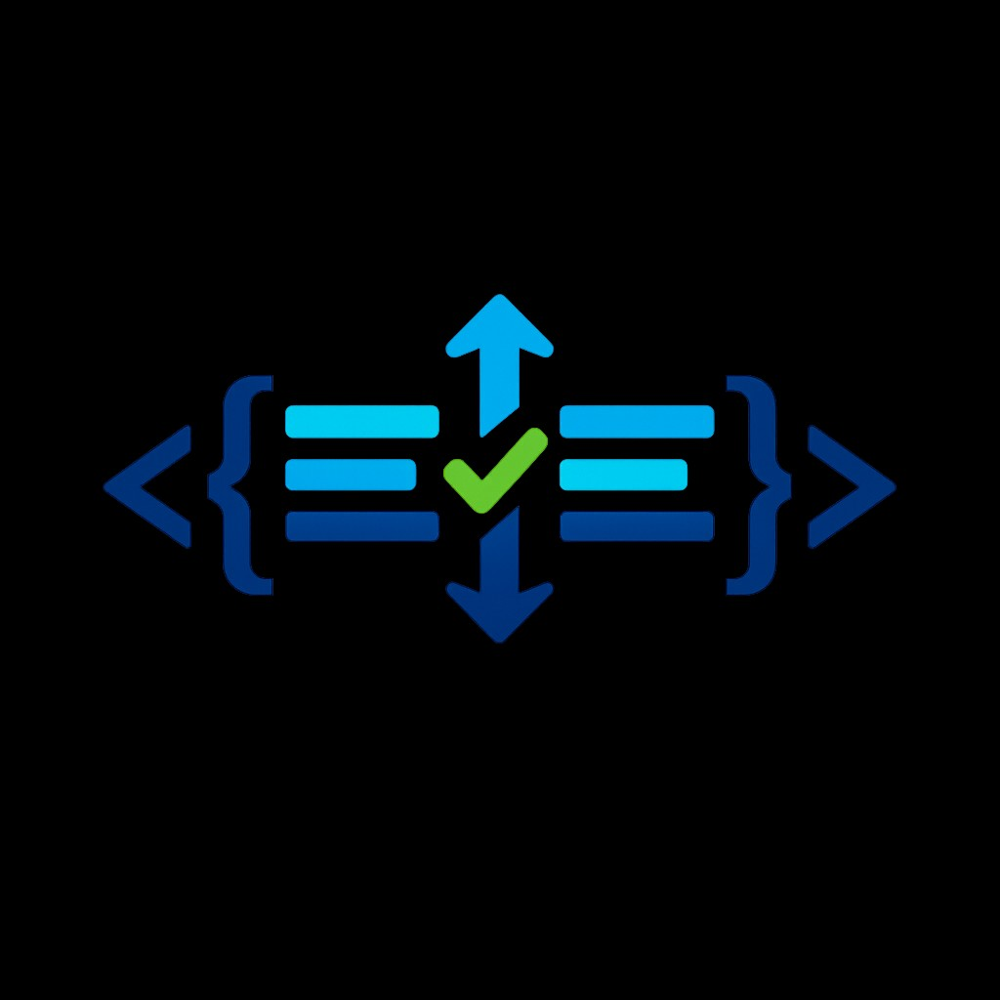

<p align="center">
  
</p>

# Initializer Order Fixer

Desktop tool that scans C/C++ repositories and fixes constructor initializer-list order to match class member declaration order in headers.
## Requirements

- Python 3.10+
- Windows / macOS / Linux

## Installation

```bash
git clone https://github.com/orikal/InitializerOrderFixer.git
cd InitializerOrderFixer
python -m venv .venv
.venv\Scripts\activate
pip install -r requirements.txt
```

On macOS/Linux, activate with `source .venv/bin/activate`.

## Run (GUI)

```bash
python main.py
```

## CLI (headless / Azure Pipeline)

Run without the graphical interface:

```bash
python main.py --no-ui --path <repository>
```

### Flags

| Flag | Description |
|------|-------------|
| `--no-ui` | Run headless (no PySide6 window). Required for CI. |
| `--path PATH` | Repository root to scan. |
| `--action {scan,fix,report}` | `scan` — detect only; `fix` — scan and apply fixes; `report` — detailed output. Default: `scan`. |
| `--include-dirs DIRS` | Comma-separated directories **to scan**, relative to `--path` (e.g. `src,lib/core`). When omitted, the entire repo is scanned. |
| `--exclude-dirs DIRS` | Comma-separated directory **names** to skip (e.g. `tests,third_party`). |
| `--report-file FILE` | Write report to file (with `--action report`; default: stdout). |
| `--format {text,json}` | Report format for `--action report`. Default: `text`. |

### Examples

```bash
# Scan only — exit code 1 if issues found (useful in CI gates)
python main.py --no-ui --path ./my-repo --action scan

# Scan and fix files in place
python main.py --no-ui --path ./my-repo --action fix

# Generate a JSON report
python main.py --no-ui --path ./my-repo --action report --format json --report-file report.json

# Scan only specific folders
python main.py --no-ui --path ./my-repo --action scan --include-dirs src,lib

# Skip specific folders (when scanning the whole repo)
python main.py --no-ui --path ./my-repo --action scan --exclude-dirs tests,generated,vendor
```

### Exit codes

| Code | Meaning |
|------|---------|
| `0` | Success — no issues (or fixes applied). |
| `1` | Issues found, or fix failures. |
| `2` | Invalid arguments or path. |

### Azure Pipeline (multi-stage)

Add a stage **after** `WindowsClone` using the included template:

```yaml
stages:
  - stage: WindowsClone
    jobs:
      - job: Clone
        pool:
          vmImage: windows-latest
        steps:
          - checkout: self
          # ... your existing steps ...

  - template: azure-pipelines/initializer-order-check.yml
    parameters:
      dependsOnStage: WindowsClone
      scanPath: $(Build.SourcesDirectory)
      includeDirs: src,components
      excludeDirs: tests,build,third_party
```

The `InitializerOrderCheck` stage runs only after `WindowsClone` succeeds. If initializer issues are found, the stage fails and blocks later stages that `dependsOn: InitializerOrderCheck`.

See `azure-pipelines/pipeline.example.yml` for a full skeleton.

For headless CI you only need `tree-sitter` and `tree-sitter-cpp` (PySide6 is not required when using `--no-ui`).

## GUI usage

1. Choose a repository folder.
2. Click **Scan Repository**.
3. Review issues in the table (double-click a row for before/after preview).
4. Select issues to fix, then click **Apply Selected Fixes** or **Apply All Fixes**.

## Test fixture

A sample mismatch is included under `test_fixtures/example/`. Point the app at that folder to verify detection and fixing.
